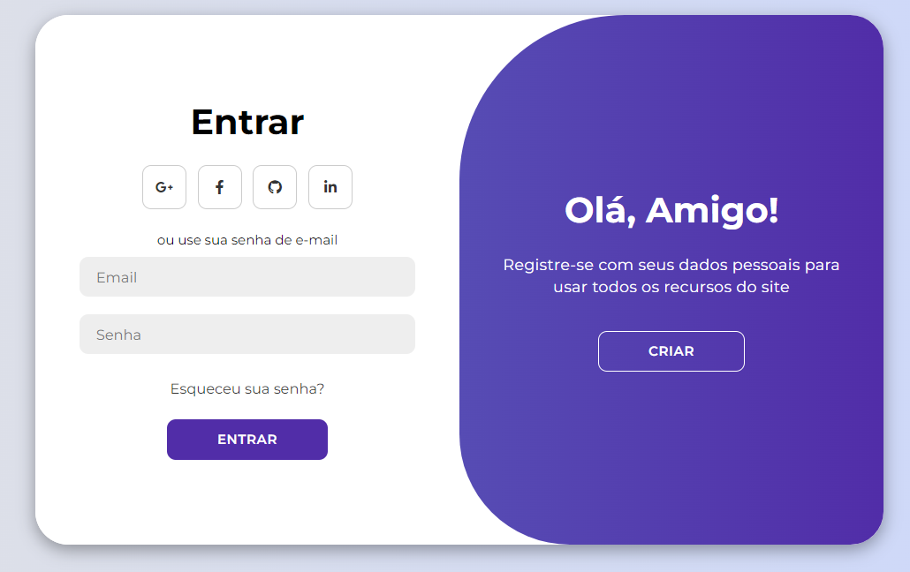

<h1 align="center"> Modern Page </h1>

Utilizei HTML, CSS e JavaScript modernos para criar um design de página de login completo com animações de login e inscrição com CSS Flexbox, transição CSS para alguns efeitos de animação interessantes e também quadros-chave CSS!

  <a href="#-tecnologias">Tecnologias</a>&nbsp;&nbsp;&nbsp;|&nbsp;&nbsp;&nbsp;
  <a href="#-projeto">Projeto</a>&nbsp;&nbsp;&nbsp;|&nbsp;&nbsp;&nbsp;
  <a href="#memo-licença">Licença</a>

  

 

  

## 🚀 Tecnologias

Esse projeto foi desenvolvido com as seguintes tecnologias:

- HTML e CSS
- JavaScript
- Git e Github

## 💻 Projeto

o Modern Page é uma forma de mostrar uma página única e inovadora para visitas online.

## :memo: Licença

Esse projeto está sob a licença MIT.

---

by Breno Cauã ♥